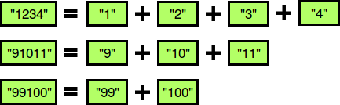

# Separate the Numbers

A numeric string, __s__ , is beautiful if it can be split into a sequence of two or more positive integers, __a1,a2,…,an__, satisfying the following conditions:

1.	__ai–ai−1=1__ for any __1<i≤n__  (i.e., each element in the sequence is 1  more than the previous element).
2.	No __ai__  contains a leading zero. For example, we can split __s=10203__ into the sequence __{1,02,03}__ , but it is not beautiful because __02__  and __03__  have leading zeroes.
3.	The contents of the sequence cannot be rearranged. For example, we can split __s=312__ into the sequence , __{3,1,2}__ but it is not beautiful because it breaks our first constraint (i.e., __1–3≠1__) .
The diagram below depicts some beautiful strings:

<div style="text-align: center;">
	
</div>

You must perform __q__ queries, where each query consists of some string __s__. For each query, print whether or not the string is beautiful on a new line. If it's beautiful, print __YES x__, where __x__ is the first number of the increasing sequence (if there are multiple such values of __x__, choose the smallest); otherwise, print NO instead.

__Sample Input__

```
1234
91011
99100
101103
010203
13
1
```

__Sample Output__

```
YES 1
YES 9
YES 99
NO
NO
NO
NO
```